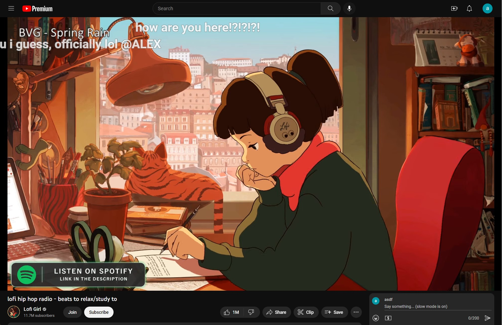

# Flow Chat for YouTube Live
> Chrome Extension for Flow Chat Messages on YouTube Live.

> [!IMPORTANT]
> This is a fork of the original extension by fiahfy.

## Fork changes from fiahfy's original extension

- Removed option to have bottom chat controls. Reason: YouTube's code became incompatible with how the bottom chat input was being moved.
- Live chat input has been moved on top of the live chat (right below the video). It isn't visible in fullscreen unless you scroll down.
- Tab visibility awareness. Better performance when leaving/entering the tab.
- Removed filtering due to performance concerns with original implementation.



## Installation

1. Download a release from the released page in this repo, and unzip the "app" folder somewhere.
2. Open the Extension Management page by navigating to `chrome://extensions`.
3. Enable Developer Mode by clicking the toggle switch next to **Developer mode**.
4. Click the **LOAD UNPACKED** button and select the unpacked directory named `app`.

## Development

```bash
# install dependencies
yarn

# watch files changed and reload extension
yarn dev
```
